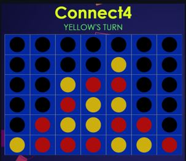
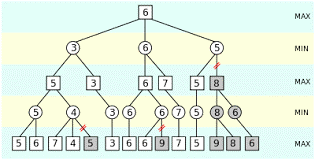

# CONNECT-4 WEBAPP with COMPUTER BOT

 ### MENTORS
 - Adithya Rajesh
 - Anirudh Achal

### MEMBORS

 - Dhruvil Lakhtaria
 - Pranav RS

# Project Goal

The aim of the project was to implement a connect 4 webapp with an intelligent computer bot which makes the best possible move based on the current board state.

## What is Connect-4
Connect-4 is a two-player board game in which player tries to connect 4 dots of his color and opponent does the same. The dot is dropped on the lower most empty row of the column chose.

## MINIMAX ALGORITH

Minimax algorithm is a backtracking algorithm that has two parts namely maximiser and minimizer. The maximiser tries to maximize the score while the minimizer tries to minimize the score as much as possible.

Each board state has a value associates to it and maximiser tries to make the move such that the value increases while the minimizer does the opposite.

For Example, consider the above image where the evaluation is done till 4 level and then scores are evaluated. Here score is random but in the project, scoring is done based on heuristic analysis.

Here going down the first branch we get 10 and Infinity, being minimizers turn it selects 10.

Returns 10 to level 2 then now going down the second branch from 1st node of level 2 we get 5 and since it is maximisers turn now so it stays 10 rather than taking 5 .

This way each and every possible move to a certain depth is analyzed.

### Alpha-Beta Pruning

Further alpha beta pruning is done to improve the time complexity. 

Currently it is O(7^d) where d is the depth.(Which can be max 42(that is the no of cells) but it is not implementable, It is kept 8)

We can avoid going down the recursive tree from where we would not get the desired result or outcome.

We introduce two new parameter alpha and beta which are minimum maximizer score and maximum minimizer score respectively.

Condition is if alpha > beta then we don’t need to evaluate that branch further.

In above image going down from 5 to the second branch till seven ,then to 4 since it is minimizers turn 4 is picked over 7,Now observe ,the turn is of minimizer and already 5(alpha) > 4(beta).Now the most favorable outcome we can get after traversing further branches is 4 as now minimizer will pick min(4,further nodes),so going down the further branches is useless and we can cut these branches off.
Similar process is done everywhere.

## Link To Deployed Webapp : [Connect4](https://dhruvil-lakhtaria.github.io/Connect4/)

# Getting Started with Create React App

This project was bootstrapped with [Create React App](https://github.com/facebook/create-react-app).

## Available Scripts

In the project directory, you can run:

### `npm start`

Runs the app in the development mode.\
Open [http://localhost:3000](http://localhost:3000) to view it in the browser.

The page will reload if you make edits.\
You will also see any lint errors in the console.

### `npm run build`

Builds the app for production to the `build` folder.\
It correctly bundles React in production mode and optimizes the build for the best performance.

The build is minified and the filenames include the hashes.\
Your app is ready to be deployed!

See the section about [deployment](https://facebook.github.io/create-react-app/docs/deployment) for more information.

### `npm run deploy`

Creates a new branch gh-pages in your repository and deploys the app.
Make Sure to change the Homepage address in package.json and give it a appropriate url like `"homepage":"https://github-account-name.github.io/Project-Name",`.

Also add the deploy in scripts in package.json as `"deploy" : "gh-pages -d build"`

Then run the command `npm run deploy`
